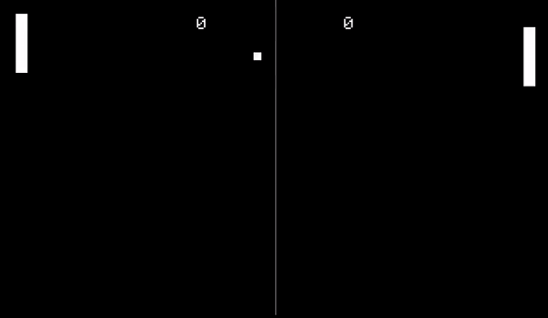

# Good Old Fashion Pong
As the title suggest, this project that aims to recreated the classic Pong Game.

## What it currently looks like

## Try It Out

### Setup
Dependencies:
 - SDL2

Windows:
 - If you're using windows and you have mingw installed, you can compile the program using the command `Build.bat` and run the executable `pong.exe`
 - If you have the g++ compiler the program manually with `g++ -std=c++14 -Iinclude -w -O3 src/*.cpp -lmingw32 -lSDL2main -lSDL2 -lSDL2_ttf -o pong.exe`

Linux:
 - If you're using linux, simply use `make` and run the executable `pong.exe`

### Controls
Player 1 (Left Side):
    - w: UP
    - s: DOWN

Player 2 (Right Side):
    - up arrow key: UP
    - down arrow key: DOWN

Press escape to quit.

### Modes
    - run the program with `pong.exe` for the regular 2 player mode
    - run the program with `pong.exe True` to play with a bot

## To Do
- Different Modes
- Better UI
